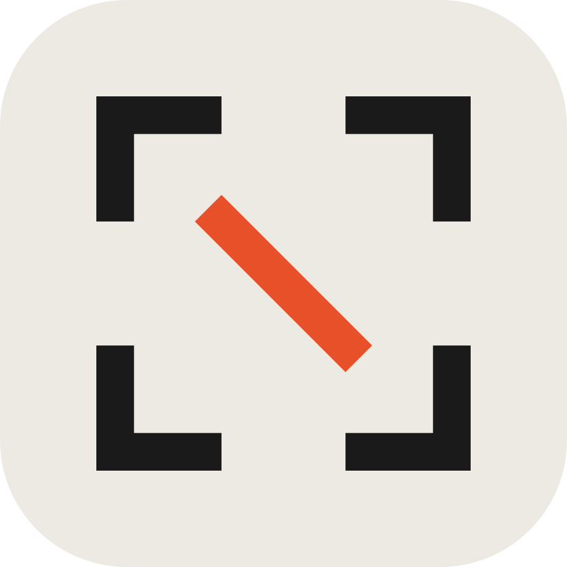
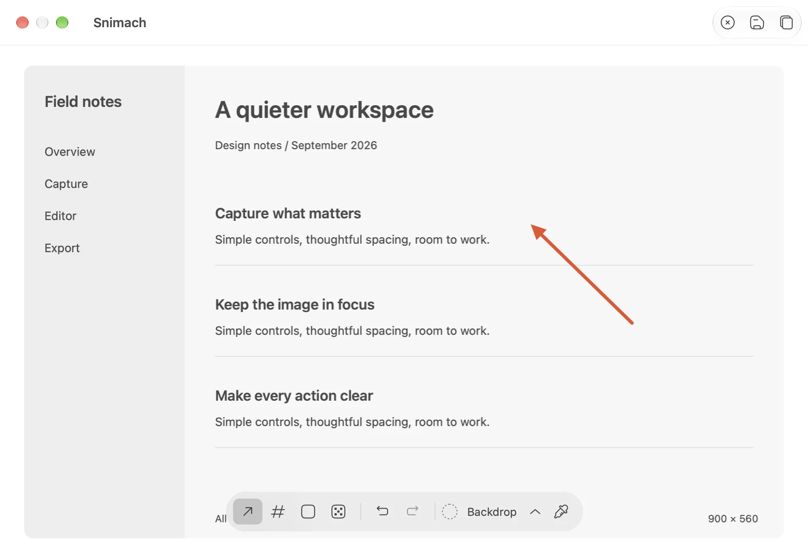

<p align="center">
  
</p>

<h1 align="center">Snimach</h1>

<p align="center">
  Menubar screenshots for macOS.<br>
  Capture with a hotkey, annotate in a small editor, and the shot is already on your clipboard.
</p>

<p align="center">
  <a href="https://github.com/infomiho/snimach/actions/workflows/ci.yml"></a>
  <a href="LICENSE"></a>
</p>



## Features

- `⌘⇧A` captures an area, `⌘⇧W` the frontmost window, `⌘⇧E` the whole screen
- Every shot lands on the clipboard right away, with a preview card you can ignore
- Arrows, numbered badges, rectangles and pixelated redaction
- Backdrops with gradient presets for shots you want to share
- A color inspector that copies the hex under the pointer
- Save to a folder of your choice, or drag the shot straight out of the preview
- A menu bar app with no dock icon, and shortcuts you can change

## Built With

**Swift** + **AppKit** + **ScreenCaptureKit** + **Sparkle**

## Install

```sh
brew install --cask infomiho/tap/snimach
```

Or download the latest DMG from [Releases](https://github.com/infomiho/snimach/releases/latest)
and drag Snimach into Applications.

Launch Snimach and grant Screen Recording access when asked.

Release downloads are signed with Developer ID and notarized by Apple.

## Editor

Enter or `⌘C` copies and closes. `⌘S` saves and copies. Esc discards.
`A` picks the arrow, `N` the numbered badge, `R` a rectangle, `B` hides an area.
`K` toggles the backdrop, `I` inspects colors. `⌘Z` and `⇧⌘Z` undo and redo.

## Run From Source

Building requires Xcode 16+ and [xcodegen](https://github.com/yonaskolb/XcodeGen).

```sh
swift test               # SnimachCore
scripts/run.sh           # builds Debug signed with your Developer ID and launches it
```

Screen Recording grants are keyed to the code signature, so the app must be signed with a real
Developer ID for the grant to survive rebuilds. `scripts/run.sh` picks it from your keychain.

## Releases

Version tags publish a signed and notarized DMG with a SHA-256 checksum on the
[releases page](https://github.com/infomiho/snimach/releases). Installed
copies check that page for updates through Sparkle and install them in place.
Maintainers set up the signing secrets once with `scripts/setup-release-signing.sh`
and the update key with `scripts/setup-sparkle-key.sh`.

Icon and library attribution is in [`THIRD_PARTY_NOTICES.md`](THIRD_PARTY_NOTICES.md).

## License

[MIT](LICENSE)
